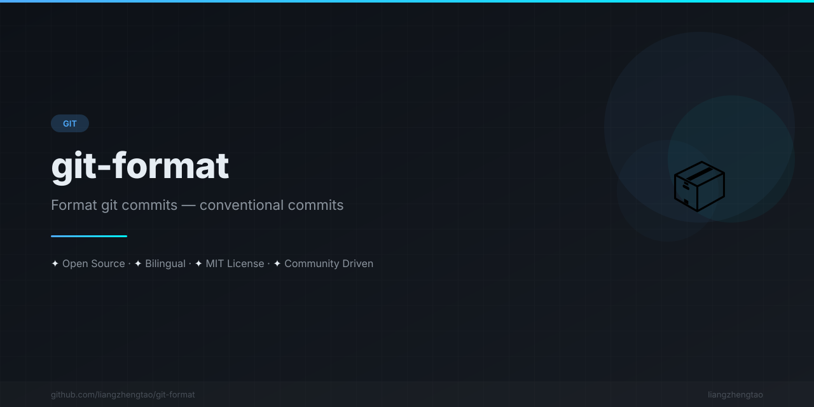

[English](README.md) | [中文](README.zh.md) | [日本語](README.ja.md) | [Français](README.fr.md) | [Español](README.es.md) | [العربية](README.ar.md) | [한국어](README.ko.md) | [Português](README.pt.md) | [Русский](README.ru.md) | [Deutsch](README.de.md)

<div align="center">



</div>


# git-format

<div align="center">

**conventional commits에 따라 git 커밋 메시지를 포맷하세요. API 키가 필요 없습니다.**

[](https://www.npmjs.com/package/git-format)
[](LICENSE)

</div>

---

## 빠른 시작

```bash
# Stage your changes
git add .

# Auto-format and commit
npx git-format

# Or just preview (dry run)
npx git-format --dry-run
```

## 기능

1. 스테이징된 파일을 읽습니다
2. 커밋 타입을 감지합니다 (feat/fix/docs/test 등)
3. 파일 경로에서 스코프를 감지합니다
4. conventional 커밋 메시지를 생성합니다
5. 포맷된 메시지로 커밋합니다

## 예시

```bash
# Stage a new feature
git add src/auth/login.ts
npx git-format
# → feat(auth): add new feature in src/auth/login.ts

# Stage a bug fix
git add src/api/users.ts
git commit -m "fix bug"
npx git-format
# → fix(api): fix issue in src/api/users.ts

# Stage documentation
git add README.md
npx git-format
# → docs: update documentation
```

## 옵션

```
npx git-format [options]

Options:
  -d, --dry-run    Show message without committing
  -j, --json       Output as JSON
  -q, --quiet      Suppress output
  -h, --help       Display help
  -V, --version    Display version
```

## 타입 감지

| 패턴 | 타입 |
|---------|------|
| `*.test.ts`, `*.spec.ts` | `test` |
| `*.md`, `*.txt` | `docs` |
| `*.css`, `*.scss` | `style` |
| `package.json` | `chore` |
| `.github/*` | `ci` |
| `Dockerfile` | `build` |
| Diff contains "fix", "bug" | `fix` |
| Diff contains "add", "new" | `feat` |
| Default | `refactor` |

## CI 통합

```yaml
# GitHub Actions
- name: Auto-format commits
  run: |
    git add .
    npx git-format
    git push
```

## 라이선스

[MIT](LICENSE)
